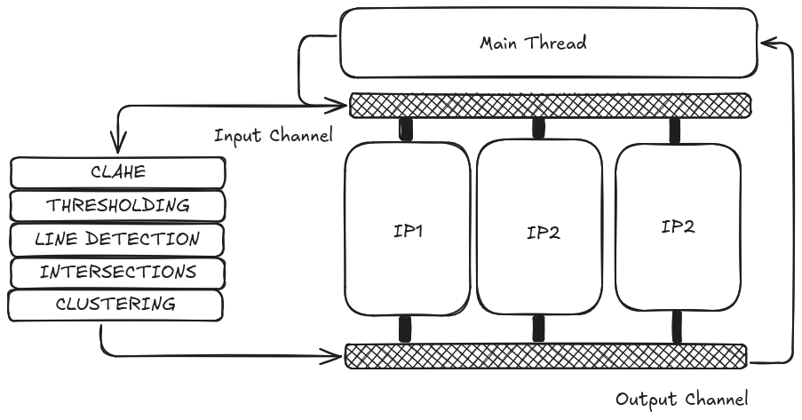

# SAUVC Gate Pose Estimation
This project implements a multi-threaded versison of a gate detection algorithm developed by @Chamooda,
This code is for the SAUVC Gate Task.

After converting the initial algorithm to C++ and multithreading with C++ threads and msd/channels, we were able to improve performance from 11-12FPS to a stable 30-40FPS* on Laptop

- FPS Measurement might be slightly incorrect

## Architecture

## Task Description
The aim of this task is to swim through a gate placed at the bottom of the pool. The gate may be located anywhere on a horizontal line, parallel to the side of the swimming pool, approximately 12m away from the starting zone. See Figure 4. The AUV has to swim through the 150 cm tall gate without touching the gate.
